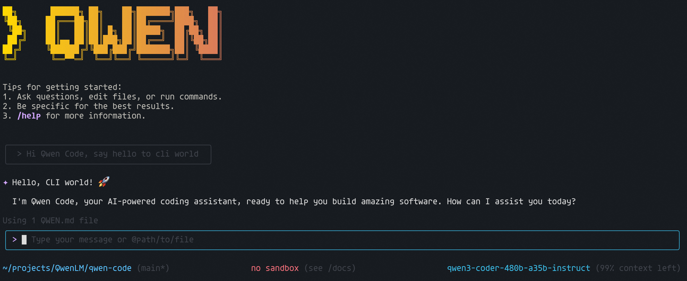

# 通义代码助手

<div align="center">



[](https://www.npmjs.com/package/@qwen-code/qwen-code)
[](./LICENSE)
[](https://nodejs.org/)
[](https://www.npmjs.com/package/@qwen-code/qwen-code)

**AI 驱动的开发者命令行工作流工�?*

[安装](#installation) �?[快速开始](#quick-start) �?[特性](#key-features) �?[文档](./docs/) �?[贡献](./CONTRIBUTING.md)

</div>

<div align="center">
  
  <a href="https://qwenlm.github.io/qwen-code-docs/de/">Deutsch</a> | 
  <a href="https://qwenlm.github.io/qwen-code-docs/fr">français</a> | 
  <a href="https://qwenlm.github.io/qwen-code-docs/ja/">日本�?/a> | 
  <a href="https://qwenlm.github.io/qwen-code-docs/ru">Русский</a> | 
  <a href="https://qwenlm.github.io/qwen-code-docs/zh/">中文</a>
  
</div>

通义代码助手是一个强大的 AI 驱动的命令行工作流工具，改编�?[**Gemini CLI**](https://github.com/google-gemini/gemini-cli) ([详情](./README.gemini.md))，专门针�?[Qwen3-Coder](https://github.com/QwenLM/Qwen3-Coder) 模型进行了优化。它通过高级代码理解、自动化任务和智能辅助来增强您的开发工作流�?
## 💡 免费选项可用

使用以下任何免费选项，零成本开始使用通义代码助手�?
### 🔥 Qwen OAuth (推荐)

- **每日 2,000 次请�?*，无令牌限制
- **每分�?60 次请�?* 的速率限制
- 只需运行 `qwen` 并使用您�?qwen.ai 账户进行身份验证
- 自动凭据管理和刷�?- 如果您使�?OpenAI 兼容模式初始化，请使�?`/auth` 命令切换�?Qwen OAuth

### 🌏 地区免费套餐

- **中国大陆**：魔搭提�?*每日 2,000 次免�?API 调用**
- **国际**：OpenRouter 提供**全球每日最�?1,000 次免�?API 调用**

有关详细设置说明，请参见 [授权](#authorization)�?
> [!WARNING]
> **令牌使用说明**：通义代码助手可能在每个周期内发出多个 API 调用，导致更高的令牌使用量（类似�?Claude Code）。我们正在积极优�?API 效率�?
## 主要特�?
- **代码理解与编�?* - 查询和编辑超出传统上下文窗口限制的大型代码库
- **工作流自动化** - 自动执行操作任务，如处理拉取请求和复杂的变基操作
- **增强解析�?* - 专门针对 Qwen-Coder 模型优化的适配解析�?- **视觉模型支持** - 自动检测输入中的图像，并无缝切换到支持视觉的模型进行多模态分�?
## 安装

### 先决条件

确保您已安装 [Node.js 版本 20](https://nodejs.org/en/download) 或更高版本�?
```bash
curl -qL https://www.npmjs.com/install.sh | sh
```

### �?npm 安装

```bash
npm install -g @qwen-code/qwen-code@latest
qwen --version
```

### 从源码安�?
```bash
git clone https://github.com/QwenLM/qwen-code.git
cd qwen-code
npm install
npm install -g .
```

### 使用 Homebrew 全局安装 (macOS/Linux)

```bash
brew install qwen-code
```

## Quick Start

```bash
# Start Qwen Code
qwen

# Example commands
> Explain this codebase structure
> Help me refactor this function
> Generate unit tests for this module
```

### 会话管理

通过可配置的会话限制控制您的令牌使用量，以优化成本和性能�?
#### 配置会话令牌限制

在您的主目录中创建或编辑 `.qwen/settings.json`�?
```json
{
  "sessionTokenLimit": 32000
}
```

#### 会话命令

- **`/compress`** - 压缩对话历史以在令牌限制内继�?- **`/clear`** - 清除所有对话历史并重新开�?- **`/stats`** - 检查当前令牌使用量和限�?
> 📝 **注意**：会话令牌限制适用于单个对话，而不是累积的 API 调用�?
### Vision Model Configuration

Qwen Code includes intelligent vision model auto-switching that detects images in your input and can automatically switch to vision-capable models for multimodal analysis. **This feature is enabled by default** - when you include images in your queries, you'll see a dialog asking how you'd like to handle the vision model switch.

#### Skip the Switch Dialog (Optional)

If you don't want to see the interactive dialog each time, configure the default behavior in your `.qwen/settings.json`:

```json
{
  "experimental": {
    "vlmSwitchMode": "once"
  }
}
```

**����ģʽ��**

- **`"once"`** - ��Ϊ�˲�ѯ�л����Ӿ�ģ�ͣ�Ȼ��ָ�
- **`"session"`** - Ϊ�����Ự�л����Ӿ�ģ��
- **`"persist"`** - Continue with current model (no switching)
- **���** - Show interactive dialog each time (default)

#### �������

��Ҳ����ͨ��������������Ϊ��

```bash
# ÿ�β�ѯ�л�һ��
qwen --vlm-switch-mode once

# Ϊ�����Ự�л�
qwen --vlm-switch-mode session

# �Ӳ��Զ��л�
qwen --vlm-switch-mode persist
```

#### 禁用视觉模型（可选）

要完全禁用视觉模型支持，请添加到您的 `.qwen/settings.json`：

```json
{
  "experimental": {
    "visionModelPreview": false
  }
}
```

> 💡 **Tip**: In YOLO mode (`--yolo`), vision switching happens automatically without prompts when images are detected.

### 授权

根据您的需求选择首选的身份验证方法�?
#### 1. Qwen OAuth (🚀 推荐 - 30 秒内开�?

最简单的入门方式 - 完全免费且配额充足：

```bash
# 只需运行此命令并按照浏览器身份验�?qwen
```

**发生什么：**

1. **即时设置**：CLI 自动打开您的浏览�?2. **一键登�?*：使用您�?qwen.ai 账户进行身份验证
3. **自动管理**：凭据缓存在本地以供将来使用
4. **无需配置**：零设置要求 - 直接开始编码！

**免费套餐福利�?*

- �?**每日 2,000 次请�?*（无需计算令牌�?- �?**每分�?60 次请�?* 速率限制
- �?**自动凭据刷新**
- �?**个人用户零成�?*
- ℹ️ **注意**：为保持服务质量，可能会发生模型回退

#### 2. OpenAI-Compatible API

Use API keys for OpenAI or other compatible providers:

**Configuration Methods:**

1. **Environment Variables**

   ```bash
   export OPENAI_API_KEY="your_api_key_here"
   export OPENAI_BASE_URL="your_api_endpoint"
   export OPENAI_MODEL="your_model_choice"
   ```

2. **Project `.env` File**
   Create a `.env` file in your project root:
   ```env
   OPENAI_API_KEY=your_api_key_here
   OPENAI_BASE_URL=your_api_endpoint
   OPENAI_MODEL=your_model_choice
   ```

**API Provider Options**

> ⚠️ **Regional Notice:**
>
> - **Mainland China**: Use Alibaba Cloud Bailian or ModelScope
> - **International**: Use Alibaba Cloud ModelStudio or OpenRouter

<details>
<summary><b>🇨🇳 中国大陆用户</b></summary>

**选项 1: 阿里云百�?* ([申请 API 密钥](https://bailian.console.aliyun.com/))

```bash
export OPENAI_API_KEY="your_api_key_here"
export OPENAI_BASE_URL="https://dashscope.aliyuncs.com/compatible-mode/v1"
export OPENAI_MODEL="qwen3-coder-plus"
```

**选项 2: 魔搭 (免费套餐)** ([申请 API 密钥](https://modelscope.cn/docs/model-service/API-Inference/intro))

- �?**每日 2,000 次免�?API 调用**
- ⚠️ 连接您的阿里云账户以避免身份验证错误

```bash
export OPENAI_API_KEY="your_api_key_here"
export OPENAI_BASE_URL="https://api-inference.modelscope.cn/v1"
export OPENAI_MODEL="Qwen/Qwen3-Coder-480B-A35B-Instruct"
```

</details>

<details>
<summary><b>🌍 国际用户</b></summary>

**选项 1: 阿里云模型服务灵�?* ([申请 API 密钥](https://modelstudio.console.alibabacloud.com/))

```bash
export OPENAI_API_KEY="your_api_key_here"
export OPENAI_BASE_URL="https://dashscope-intl.aliyuncs.com/compatible-mode/v1"
export OPENAI_MODEL="qwen3-coder-plus"
```

**选项 2: OpenRouter (提供免费套餐)** ([申请 API 密钥](https://openrouter.ai/))

```bash
export OPENAI_API_KEY="your_api_key_here"
export OPENAI_BASE_URL="https://openrouter.ai/api/v1"
export OPENAI_MODEL="qwen/qwen3-coder:free"
```

</details>

## 使用示例

### 🔍 探索代码�?
```bash
cd your-project/
qwen

# 架构分析
> 描述此系统架构的主要组成部分
> 关键依赖项是什么，它们如何交互�?> 查找所�?API 端点及其身份验证方法
```

### 💻 代码开�?
```bash
# 重构
> 重构此函数以提高可读性和性能
> 将此类转换为使用依赖注入
> 将此大型模块拆分为更小、更专注的组�?
# 代码生成
> 为用户管理创建一�?REST API 端点
> 为身份验证模块生成单元测�?> 为所有数据库操作添加错误处理
```

### 🔄 自动化工作流

```bash
# Git 自动�?> 分析过去 7 天的 git 提交，按功能分组
> 根据最近的提交创建变更日志
> 查找所�?TODO 注释并创�?GitHub 问题

# 文件操作
> 将此目录中的所有图像转换为 PNG 格式
> 重命名所有测试文件以遵循 *.test.ts 模式
> 查找并删除所�?console.log 语句
```

### 🐛 调试与分�?
```bash
# 性能分析
> 识别�?React 组件中的性能瓶颈
> 查找代码库中的所�?N+1 查询问题

# 安全审计
> 检查潜在的 SQL 注入漏洞
> 查找所有硬编码的凭据或 API 密钥
```

## 流行任务

### 📚 理解新代码库

```text
> 核心业务逻辑组件是什么？
> 有哪些安全机制？
> 数据如何在系统中流动�?> 使用了哪些主要设计模式？
> 为该模块生成依赖关系�?```

### 🔨 代码重构与优�?
```text
> 该模块的哪些部分可以优化�?> 帮我重构此类以遵�?SOLID 原则
> 添加适当的错误处理和日志记录
> 将回调转换为 async/await 模式
> 为昂贵操作实现缓�?```

### 📝 文档与测�?
```text
> 为所有公�?API 生成全面�?JSDoc 注释
> 为此组件编写包含边界情况的单元测�?> �?OpenAPI 格式创建 API 文档
> 添加解释复杂算法的内联注�?> 为该模块生成 README
```

### 🚀 开发加�?
```text
> 设置带有身份验证的新 Express 服务�?> 创建带有 TypeScript 和测试的 React 组件
> 实现速率限制中间�?> 为新架构添加数据库迁�?> 为此项目配置 CI/CD 管道
```

## 命令与快捷键

### 会话命令

- `/help` - 显示可用命令
- `/clear` - 清除对话历史
- `/compress` - 压缩历史以节省令�?- `/stats` - 显示当前会话信息
- `/exit` �?`/quit` - 退出通义代码助手

### 键盘快捷�?
- `Ctrl+C` - 取消当前操作
- `Ctrl+D` - 退出（在空行上�?- `Up/Down` - 导航命令历史

## 基准测试结果

### Terminal-Bench 性能

| 代理      | 模型               | 准确�?  |
| --------- | ------------------ | -------- |
| 通义代码助手 | Qwen3-Coder-480A35 | 37.5%    |
| 通义代码助手 | Qwen3-Coder-30BA3B | 31.3%    |

## 开发与贡献

请参�?[CONTRIBUTING.md](./CONTRIBUTING.md) 了解如何为项目做贡献�?
有关详细的身份验证设置，请参�?[身份验证指南](./docs/cli/authentication.md)�?
## 故障排除

如果遇到问题，请查看 [故障排除指南](docs/troubleshooting.md)�?
## 致谢

此项目基�?[Google Gemini CLI](https://github.com/google-gemini/gemini-cli)。我们承认并感谢 Gemini CLI 团队的优秀工作。我们的主要贡献集中在解析器级别的适配，以更好地支�?Qwen-Coder 模型�?
## 许可�?
[LICENSE](./LICENSE)

## Star 历史

[](https://www.star-history.com/#QwenLM/qwen-code&Date)


